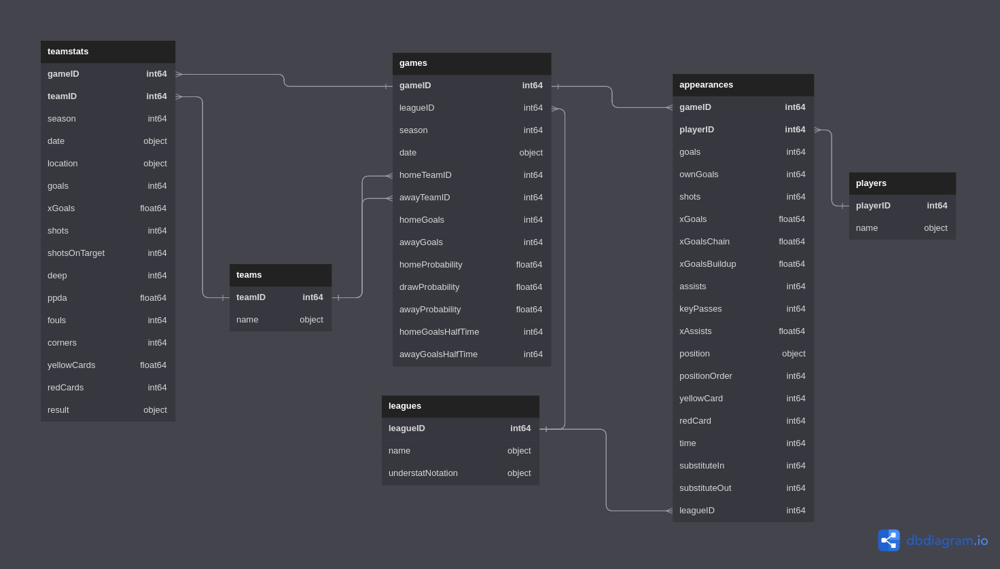
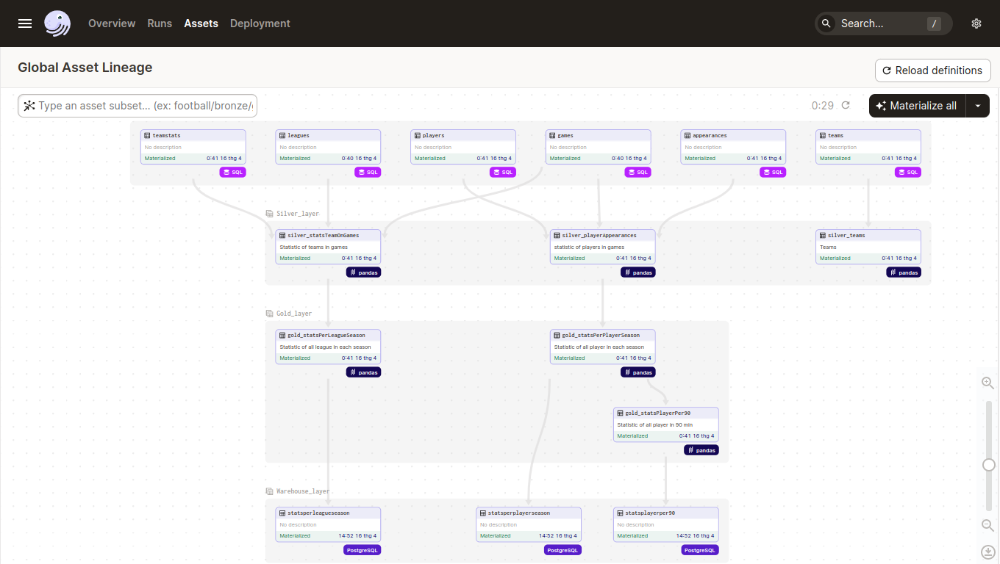

# Football_ETL_Analysis
[](https://opensource.org/licenses/MIT)

## Introduction
Project nhằm xây dựng End-to-End data pipeline theo mô hình ETL (Extract - Transform - Load) kết hợp thực hiện việc phân tích và trực quan hóa dữ liệu trên Dashboard

Project phân tích dựa trên bộ dữ liệu về Football Database của [Kaggle](https://www.kaggle.com/) nhằm đưa đến cái nhìn tổng quát về thế giới bóng đá.

## Overview
### Data 
Để tìm hiểu về data, hay đọc qua file [Exploratory Data Analysis](/EDA.ipynb)

**Nếu muốn run, ta cần một môi trường có Python và các gói được liệt kê ở phần Import Package đầu file**

Data gồm các bảng được thiết kế schema như sau


### ETL Platform


Trong đó:
- **E**: Extract process, quá trình này lấy data từ **MySQL** để xử lý và tạm lưu trử ở **MinIO.**
- **T**: Transform process, thực hiện xử lý, sàn lọc và truy vấn các thông tin có giá trị từ raw data.
- **L**: Loading process, đẩy data sạch vào **PostgreSQL** và cũng dùng đó là Data warehouse.

### Technologies Used
- **Data Orchestration**: [Dagster](https://dagster.io/)
- **Containerized Application Development**: [Docker](https://www.docker.com/)
- **Database**: [MySQL](https://www.mysql.com/), [PostgreSQL](https://www.postgresql.org/)
- **Object Storage**: [MinIO](https://min.io/)
- **Data Dashboard**: [Streamlit](https://streamlit.io/)

## Prerequisite
1. [Docker](https://www.docker.com/)
2. [Git](https://git-scm.com/)

## Set up
1. Đầu tiên ta clone git repo này về local bằng `git clone`
2. Tạo file `.env` có nội dung giống với [env.template](env.template)
3. Copy file này vào `.\streamlit\src\`
Sau khi hoàn thành, ta sẽ khởi động trên terminal bằng
```bash
$make up
``` 
Nếu dùng Window và không thể run lệnh trên, hãy dùng `docker compose up`(các lệnh tương ứng với make xem trong [Makefile](Makefile))

**Lần đầu chạy có thể gặp lỗi, nếu có hãy thử kiểm tra images và build images bằng `make build` hoặc `docker compose build` trước khi run lệnh trên hoặc `make restart` vài lần**

4. Data setup
Bước này, ta sẽ chuẩn bị data trong `MySQL` để giả định nguồn dữ liệu có sẵn. Hãy run lệnh sau:
```bash
$docker cp /football de_mysql:/tmp/dataset/
$docker cp /load_data de_mysql:/tmp/dataset/
```
Sau đó ta sẽ tạo bảng trống sẵn:
```bash
$make mysql_create #Create table in mysql
```
Tiếp tục với lệnh:
```bash
$make to_mysql_root
SET GLOBAL LOCAL_INFILE=TRUE; #Set local_infile variable to load data from local
exit;
$make mysql_load #load data
$make mysql_create_relation #create table relation
```
Sau đó đến PostgreSQL, ta cũng sẽ tạo một schema sẵn riêng cho project
```bash
$make to_psql
CREATE SCHEMA IF NOT EXISTS analysis;
exit;
```
Sau khi hoàn tất các bước trên, ta đã có thể bắt đầu thực hiện ETL được rồi
## How to use
Để chắc chắn ổn, hãy `make restart` để các services set up lại.

Xem các service, check ở localhost:
- Xem MinIO, check port 9000
- Xem Dagster Data pipeline, check port 3001. 
Hãy **materirialize** và kiểm tra data trong PostgreSQL sau khi hoàn tất

- Xem Streamlit Dashboard, check port 8501

## Future Update
Xây dựng thêm cách để phân tích dữ liệu trong warehouse với `dbt`

Kết hợp xây dựng các model Machine learning hoặc xử lý hình ảnh cầu thủ

## Conclusion
Project hướng dẫn xây dựng mô hình ETL cơ bản đơn giản.
